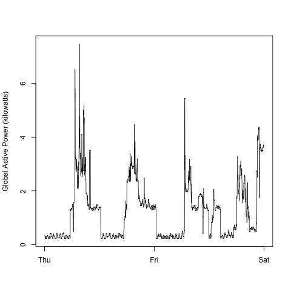
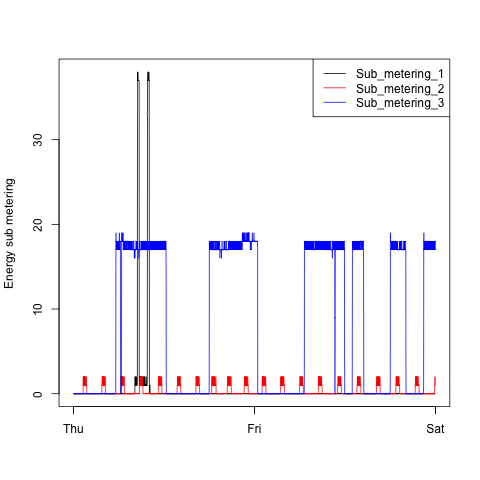
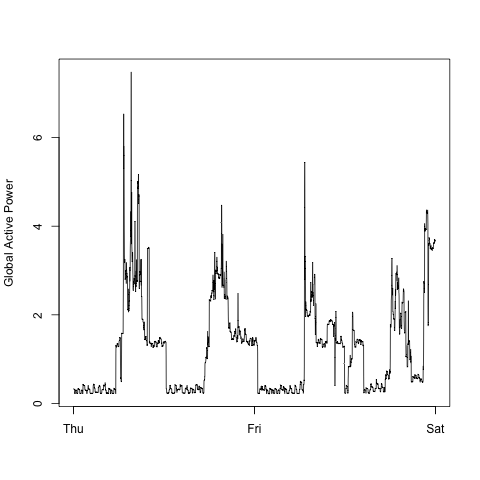

## Exploratory Data Analysis Programming Assignment 1

First, I have not included the data file in the repository.  If you actually run this, you will need the the <b>household_power_consumption.txt</b>.  That is available at https://d396qusza40orc.cloudfront.net/exdata%2Fdata%2Fhousehold_power_consumption.zip

Description of .R files
* <b>shared.R</b>: Contains the bulk of the code for manipulating data and generating the specific graphs.
* <b>plot1.R</b>: Reads shared.R and generates plot1.png
* <b>plot2.R</b>: Reads shared.R and generates plot2.png
* <b>plot3.R</b>: Reads shared.R and generates plot3.png
* <b>plot4.R</b>: Reads shared.R and generates plot4.png
* <b>plot_1234.R</b>: Reads shared.R and generates plot1.png, plot2.png, plot3.png and plot4.png.  This is the most efficient means of generating all plots and data is read and tidied up only once for  all plots.

Plot files (.PNG's).  The .PNG's in the directory are visible in this help page after the intrusctions on running the scripts.
* <b>plot1.png</b>: output of plot1.R
* <b>plot2.png</b>: output of plot2.R
* <b>plot3.png</b>: output of plot3.R
* <b>plot4.png</b>: output of plot4.R

## Running the scripts
In R, load the .R file associated with the plot you want to generate.  As an example, from the R cosole to generate plot1.png, execute the following command: <i>source("plot1.R")</i>

## For your convenience: the plots

### Plot 1
 
### Plot 2
 
### Plot 3
 
### Plot 4
 
